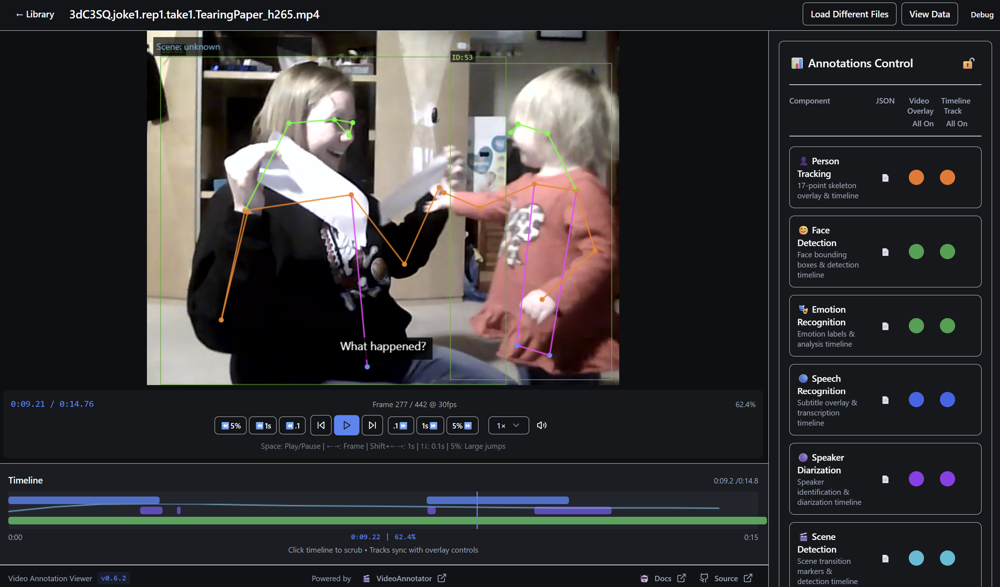

<div align="center">
  
  <h1>Video Annotation Viewer v0.3.0</h1>
</div>

Advanced multimodal video annotation analysis tool for both **reviewing VideoAnnotator pipeline outputs** and **creating new annotation jobs**. Features synchronized pose detection, speech recognition, speaker diarization, and scene detection visualization with integrated job management.

## Overview

Video Annotation Viewer is a sophisticated web-based application designed for researchers and analysts working with multimodal video data. It provides an integrated interface for reviewing the outputs of automated video analysis pipelines, particularly those generated by the VideoAnnotator system.


*Video Annotation Viewer interface showing synchronized multimodal annotations including pose detection, facial emotion recognition, speech recognition, speaker diarization, and scene detection overlays.*

## 🎯 Key Features

### 📹 **VideoAnnotator Integration**
- **Native Support**: Direct compatibility with VideoAnnotator pipeline outputs
- **Standard Formats**: COCO keypoints, WebVTT subtitles, RTTM speaker data, scene detection JSON
- **Multi-file Loading**: Drag-and-drop interface for video + annotation files
- **Automatic Detection**: Intelligent file type recognition and validation

### 🎬 **Job Creation & Management** *(New in v0.3.0)*
- **Create Annotation Jobs**: Submit videos for processing through VideoAnnotator API
- **Pipeline Selection**: Choose from scene detection, person tracking, face analysis, and audio processing
- **Batch Processing**: Handle multiple videos simultaneously
- **Real-time Monitoring**: Track job progress with live status updates
- **Job Management**: View, monitor, and manage all annotation jobs in one interface

### 🎥 **Multimodal Visualization**
- **Pose Detection**: COCO-format human pose keypoints with 17-point skeleton rendering
- **Speech Recognition**: WebVTT subtitle display with precise timing
- **Speaker Diarization**: RTTM-based speaker identification and timeline visualization  
- **Scene Detection**: Scene boundary markers and transition analysis
- **Track Persistence**: Person tracking with consistent identity across frames

### 📊 **Interactive Timeline**
- **Time-based Navigation**: Click-to-seek with millisecond precision
- **Multi-track Display**: Speech, speaker, scene, and motion tracks
- **Synchronized Playback**: All annotations stay perfectly aligned with video
- **Hover Details**: Rich information tooltips for timeline events

### 🎛️ **Professional Controls**
- **Unified Interface**: Elegant two-column layout with video player and integrated control panel
- **Color-Coded Controls**: Intuitive colored circle buttons for each annotation component
- **Smart Toggles**: Individual overlay management with synchronized timeline controls
- **Lock Functionality**: Padlock feature for coordinated control modes
- **JSON Viewers**: Individual data inspection buttons for each pipeline component
- **Debug Panel**: Professional debugging interface (Ctrl+Shift+D) with automated testing
- **Navigation**: Easy return to home and access to VideoAnnotator documentation
- **Demo Datasets**: Multiple built-in sample datasets including VEATIC silent video

## 📁 Supported File Formats

### Video Files
- **MP4** (H.264/H.265)
- **WebM** 
- **AVI**
- **MOV**

### Annotation Files
- **Person Tracking**: COCO JSON format with keypoints and bounding boxes
- **Speech Recognition**: WebVTT (.vtt) files with timestamped transcriptions
- **Speaker Diarization**: RTTM (.rttm) files in NIST format
- **Scene Detection**: JSON arrays with scene boundaries and classifications
- **Audio**: Separate WAV files for audio analysis

## 🚀 Quick Start

### Demo Mode
1. Open the application
2. Click **"View Demo"** on the welcome screen
3. Explore the sample VideoAnnotator dataset with full multimodal annotations

### Load Your Own Data
1. Click **"Get Started"** from the welcome screen
2. Drag and drop your files:
   - One video file (e.g., `video.mp4`)
   - Multiple annotation files (e.g., `person_tracking.json`, `speech.vtt`, `speakers.rttm`, `scenes.json`)
3. The system automatically detects and validates file formats
4. Click **"Start Viewing"** to begin analysis

### Create New Annotation Jobs *(New in v0.3.0)*
1. Click **"Create Annotations"** from the main interface
2. Navigate to **"New Job"** in the job management panel
3. Upload your video files (supports batch processing)
4. Select annotation pipelines (scene detection, person tracking, face analysis, audio processing)
5. Configure pipeline parameters or use defaults
6. Submit jobs and monitor progress in real-time
7. View completed results directly in the annotation viewer

## 📊 Data Structure Examples

### COCO Person Tracking
```json
{
  "id": 1,
  "image_id": "frame_0001",
  "category_id": 1,
  "keypoints": [x1, y1, v1, x2, y2, v2, ...], // 17 keypoints × 3 values
  "bbox": [x, y, width, height],
  "track_id": 1,
  "timestamp": 1.25,
  "score": 0.95
}
```

### WebVTT Speech Recognition
```
WEBVTT

00:00:01.000 --> 00:00:03.500
Hello, how are you doing today?

00:00:04.000 --> 00:00:06.200
I'm doing great, thanks for asking.
```

### RTTM Speaker Diarization
```
SPEAKER filename 1 1.25 2.30 <NA> <NA> SPEAKER_00 <NA> <NA>
SPEAKER filename 1 3.80 1.50 <NA> <NA> SPEAKER_01 <NA> <NA>
```

### Scene Detection
```json
[
  {
    "id": 1,
    "start_time": 0.0,
    "end_time": 5.2,
    "scene_type": "conversation",
    "score": 0.89
  }
]
```

## 🔧 Development

### Prerequisites
- Node.js 18+ or Bun runtime
- Modern web browser with ES2020 support

### Local Development
```bash
# Clone the repository
git clone https://github.com/InfantLab/video-annotation-viewer.git
cd video-annotation-viewer

# Install dependencies
bun install
# or npm install

# Start development server
bun run dev
# or npm run dev

# Build for production
bun run build
# or npm run build
```

### Project Structure
```
src/
├── components/           # React components
│   ├── VideoPlayer.tsx   # Main video player with overlays
│   ├── Timeline.tsx      # Interactive timeline component
│   ├── FileUploader.tsx  # Multi-file upload interface
│   └── ...
├── lib/parsers/          # Format-specific parsers
│   ├── coco.ts          # COCO format parser
│   ├── webvtt.ts        # WebVTT parser
│   ├── rttm.ts          # RTTM parser
│   └── merger.ts        # Data integration utility
├── types/               # TypeScript type definitions
│   └── annotations.ts   # Standard format interfaces
└── utils/               # Utility functions
    ├── debugUtils.ts    # Demo data loading
    └── version.ts       # Version management
```

## 🎯 Use Cases

### Research Applications
- **Behavioral Analysis**: Review automated behavior detection results
- **Algorithm Validation**: Verify computer vision pipeline accuracy
- **Multimodal Studies**: Analyze speech, movement, and visual data together
- **Dataset Annotation**: Quality control for training data

### Clinical & Educational
- **Therapy Assessment**: Analyze patient-therapist interactions
- **Developmental Studies**: Track child development indicators
- **Social Interaction**: Study group dynamics and communication patterns
- **Movement Analysis**: Assess motor skills and physical therapy progress

## 🔗 Integration with VideoAnnotator

**Important**: This project is designed to be used **in conjunction with VideoAnnotator**. Here's how they work together:

### The Two-Step Process
1. **VideoAnnotator** processes your videos to generate annotation data:
   - Analyzes video files using advanced computer vision and ML pipelines
   - Outputs standardized annotation files (COCO, WebVTT, RTTM, JSON)
   - Handles the computationally intensive analysis work

2. **Video Annotation Viewer** (this project) visualizes and reviews those results:
   - Loads VideoAnnotator output files alongside original videos
   - Provides interactive visualization and playback controls
   - Enables detailed review and quality assessment

### Workflow Integration
```
Your Video Files → [VideoAnnotator Processing] → Annotation Files → [This Viewer] → Interactive Analysis
```

### Related Projects
Video Annotation Viewer integrates seamlessly with:
- **[VideoAnnotator](https://github.com/InfantLab/VideoAnnotator)**: Primary annotation processing pipeline
- **Research Workflows**: Export-ready data formats for further analysis
- **Analysis Tools**: Standard format compatibility for statistical processing

## 📈 Version History

For detailed release notes and changes, see [CHANGELOG.md](CHANGELOG.md).

- **v0.3.0**: VideoAnnotator Job Creation & Management (August 2025)
  - **Job Creation Wizard**: Create new annotation jobs through VideoAnnotator API
  - **Pipeline Management**: Select and configure scene detection, person tracking, face analysis, and audio processing
  - **Batch Processing**: Submit multiple videos simultaneously
  - **Real-time Monitoring**: Live job status updates and progress tracking
  - **Professional Interface**: Enhanced UI with consistent branding and improved user experience
  - **API Integration**: Full VideoAnnotator server integration with authentication and error handling
  
- **v0.2.0**: Enhanced interface and improved functionality (August 2025)
  - Updated project branding to "Video Annotation Viewer" 
  - Consistent GitHub repository naming (`video-annotation-viewer`)
  - New interface screenshot and social media integration
  - Improved documentation and developer experience
  
- **v0.1.0**: Initial release with full VideoAnnotator integration
  - COCO, WebVTT, RTTM, and Scene detection support
  - Multi-file upload and automatic format detection
  - Interactive timeline with synchronized playback
  - Demo dataset integration

## 📚 Documentation

Comprehensive documentation is available in the [`docs/`](./docs/) directory:

- **[Developer Guide](./docs/DEVELOPER_GUIDE.md)** - Technical architecture and development setup
- **[File Formats](./docs/FILE_FORMATS.md)** - VideoAnnotator format specifications  
- **[Debug Utils](./docs/DEBUGUTILS_GUIDE.md)** - Console debugging and testing tools
- **[Client-Server Guide](./docs/CLIENT_SERVER_COLLABORATION_GUIDE.md)** - VideoAnnotator API integration *(New in v0.3.0)*
- **[QA Testing v0.3.0](./docs/testing/QA_Checklist_v0.3.0.md)** - Current quality assurance procedures
- **[Implementation History](./docs/development/)** - Development tracking and historical records
- **[v0.4.0 Roadmap](./docs/development/ROADMAP_v0.4.0.md)** - Future feature planning

## 🤝 Contributing

This project is part of the InfantLab research ecosystem. For contributions, issues, or feature requests:

1. Check the [GitHub repository](https://github.com/InfantLab/video-annotation-viewer)
2. Review existing issues and feature requests
3. Follow the project's coding standards and testing requirements

## 📄 License

See the LICENSE file for details.

---

## 📚 Citations, Credits & Contact

### 👨‍💻 Development
**Developed by:** Caspar Addyman <infantologist@gmail.com>

### 📖 Citation
If you use this software in your research, please cite:

```
Addyman, C. (2025). Video Annotation Viewer: Interactive visualization tool for multimodal video annotation data. 
DOI: 10.5281/zenodo.16948764
```

**Zenodo DOI:** [](https://doi.org/10.5281/zenodo.16948764)


### 🤝 Contact & Support

**For Questions:** Please contact the developers at <infantologist@gmail.com>

**For Bug Reports:** Please raise a GitHub issue at:  
https://github.com/InfantLab/video-annotation-viewer/issues

**For VideoAnnotator Questions:** Visit the main VideoAnnotator repository:  
https://github.com/InfantLab/VideoAnnotator

### Acknowledgements
This work was supported by the Global Parenting Initiative (Funded by The LEGO Foundation).

---

**🏗️ Built with modern web technologies** | **⚡ Powered by Bun runtime** | **🔬 Made for researchers**
