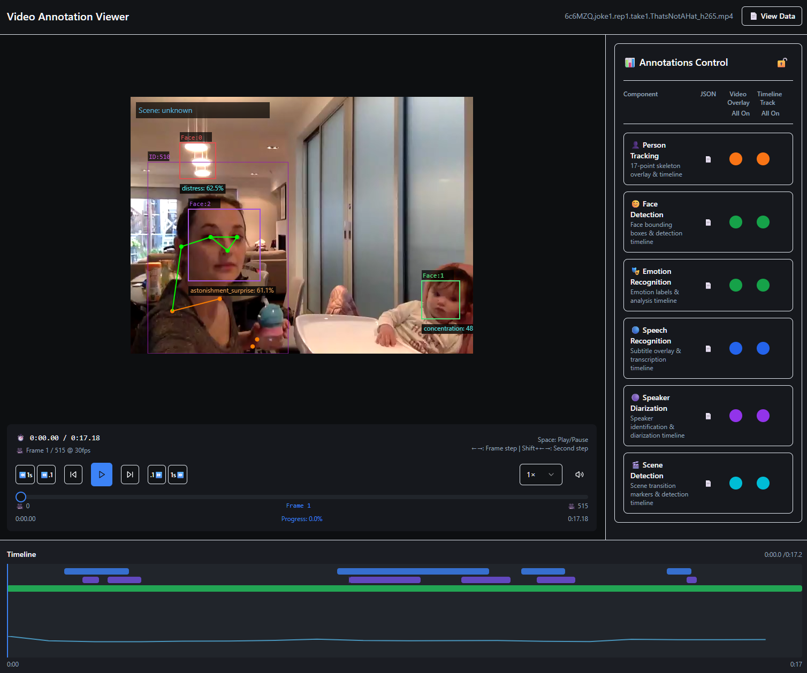

# Summary

**Video Annotation Viewer** (vav) is a lightweight web application for visualizing and auditing time-aligned annotations overlaid on video. It targets research workflows where teams need to inspect automated outputs (e.g., pose, speech, speakers, scenes), validate model behavior on real data, and communicate findings to collaborators.

vav is designed to work directly with the outputs of the companion **VideoAnnotator** system [@videoannotator], while also supporting common, tool-agnostic file formats used in multimodal research (e.g., COCO keypoints [@coco2014], WebVTT captions [@webvtt], RTTM speaker segments).

# Statement of need

Automated video analysis pipelines can process large collections of recordings, but scientific use often still depends on the ability to *inspect and trust* what detectors produced—especially in behavioral and developmental research where constructs can be subjective, context-dependent, or ethically sensitive. Researchers therefore need practical tools to:

- overlay diverse annotation streams on video for rapid spot-checking;
- compare outputs against human expectations during pipeline development;
- debug failure cases and data quality issues; and
- review results before drawing conclusions or using outputs downstream.

Video Annotation Viewer addresses this need with an interface that emphasizes **time-synchronized playback, annotation overlays, and a unified timeline** across modalities. It supports both offline review (loading video + annotation files) and optional integration with a running VideoAnnotator service for creating jobs, monitoring execution, and viewing results [@videoannotator].

# State of the field

Several tools support aspects of video annotation review, but none fully address the lightweight, time-synchronized auditing workflow described above.

General-purpose dataset curation and labeling platforms such as FiftyOne [@fiftyone] and Label Studio [@labelstudio] are powerful for organizing data and producing annotations, but they are optimized for dataset-level operations and labeling interfaces rather than lightweight auditing of heterogeneous pipeline outputs across time. Manual annotation environments such as ELAN [@elan2006] provide rich time-aligned annotation capabilities, but they do not target integration with automated ML pipelines (e.g., job submission, pipeline catalogs, and standardized results bundles) that are increasingly central to large-scale multimodal studies.

Rather than contributing to one of these existing tools, we chose to build a standalone viewer because the core requirement—synchronized overlay of diverse, independently generated annotation streams on video with minimal setup—cuts across the assumptions of existing platforms. Labeling tools assume an editing workflow; Video Annotation Viewer assumes a review workflow. By operating as a stateless, browser-based application that reads standard formats (COCO keypoints [@coco2014], WebVTT captions [@webvtt], RTTM speaker segments [@rttm2009]) it can be dropped into any pipeline without imposing its own data model.

# Functionality

Key capabilities include:

- **Multimodal overlay playback.** Render track- and event-style annotations over video, including pose keypoints (COCO-like JSON), speech transcripts (WebVTT), speaker diarization (RTTM), and scene boundaries (JSON).
- **Interactive timeline.** A synchronized, multi-track timeline supports navigation, inspection, and interpretation of overlapping annotation streams.
- **Job management (optional).** When configured with a VideoAnnotator API endpoint and token, users can create jobs, monitor progress (including server-sent events where available), and open completed results.
- **Result loading.** Users can load local files via drag-and-drop or open results downloaded from VideoAnnotator.

# Design and architecture

Video Annotation Viewer is implemented as a stateless React + TypeScript single-page application. It separates concerns into:

- **Parsers and validation.** Format-specific parsers validate and normalize inputs into internal types.
- **Viewer components.** A video player overlay layer and coordinated timeline components render time-aligned annotations.
- **API client (optional).** An API client integrates with VideoAnnotator for pipeline discovery, job submission, job status updates, and results retrieval.

This separation enables reproducible review workflows: given a video and a set of accompanying annotation files, the viewer deterministically reconstructs the same overlays and timeline presentation.

# Research impact statement

Video Annotation Viewer was developed as part of the Global Parenting Initiative's research programme studying caregiver–child interactions across diverse cultural settings. It serves as the primary review interface for the companion VideoAnnotator pipeline [@videoannotator], which processes video recordings collected in field studies. The software is actively used by researchers at Stellenbosch University and collaborating institutions to audit automated annotations before inclusion in downstream analyses. By lowering the barrier to systematic output review, the tool supports more transparent and reproducible use of automated video analysis in behavioral science.

# AI usage disclosure

Generative AI tools (GitHub Copilot and Anthropic Claude Code) were used during development to assist with code generation, test writing, and documentation drafting. All AI-generated output was reviewed, tested, and validated by the authors. The authors take full responsibility for the accuracy, originality, and correctness of the software and this paper.

# Acknowledgements

We thank colleagues and collaborators in behavioral science and machine learning who provided feedback on the need for transparent review tools to complement automated pipelines.

# References
